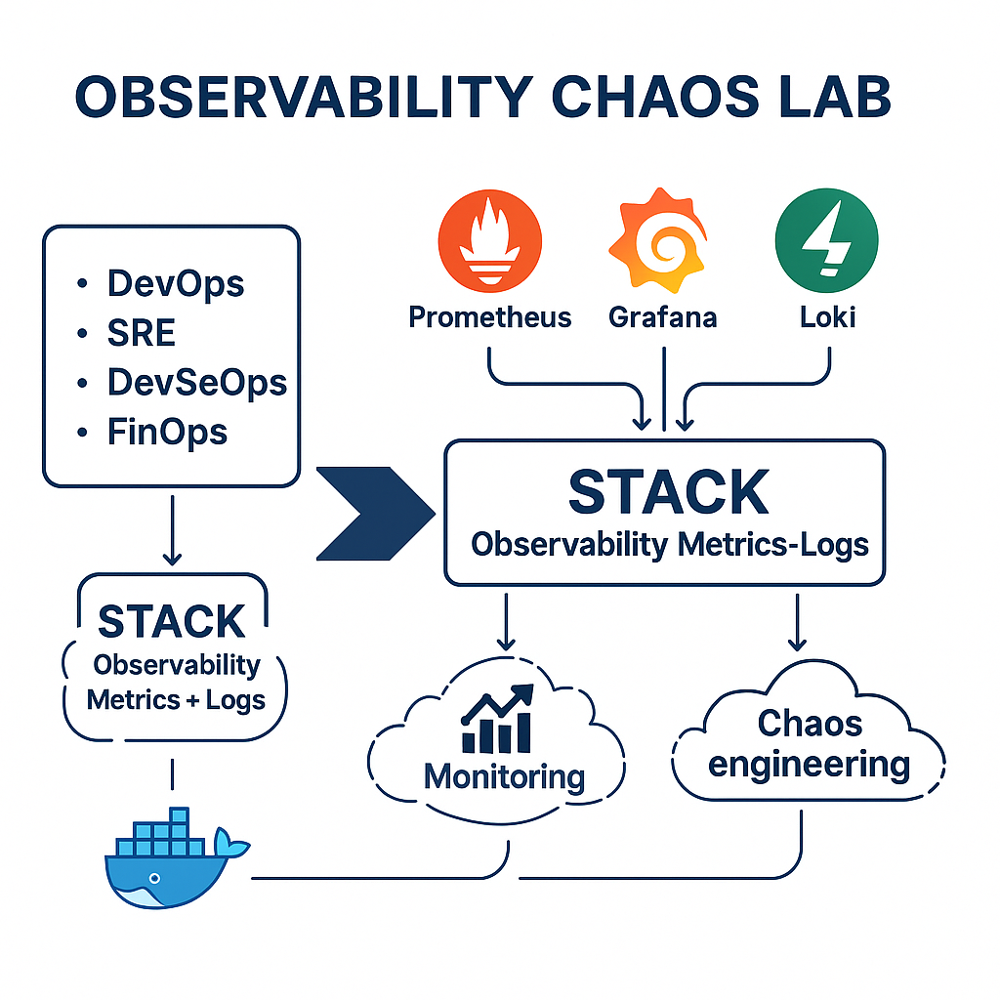

# 📘 Observability Chaos Lab — README Pedagógico (Versión Curso Completa)

## 🚀 Introducción
Este workshop está diseñado para **estudiantes, DevOps, SRE, SysAdmins y equipos de seguridad** que desean aprender observabilidad moderna desde cero, aplicando caos controlado y correlacionando métricas + logs.

El enfoque es **100% pedagógico**, pensado para acompañar tu video/clase y permitir que cualquiera pueda repetir el laboratorio desde cero.

Incluye:
- Explicación conceptual
- Flujo pedagógico del workshop
- Arquitectura visual + ASCII
- Pasos guiados
- Tablas explicativas
- Buenas prácticas DevOps / SRE
- Scripts automatizados
- Dashboards profesionales

---

# 🎯 1. Objetivo del Workshop
El objetivo principal es que el estudiante:
- Comprenda **por qué la observabilidad es clave** en un entorno SRE/DevOps.
- Arme un **stack completo reproducible** basado en Docker.
- Visualice métricas y logs en tiempo real.
- Genere **fallas controladas (chaos)** y observe su impacto.
- Aplique técnicas reales de troubleshooting profesional.

---

# 🧠 2. ¿Qué aprenderás?
- Diferenciar monitoreo vs observabilidad.
- Montar un stack moderno basado en:
  - Prometheus (métricas)
  - Node Exporter (métricas OS)
  - Loki (logs)
  - Promtail (agente de logs)
  - Grafana (visualización)
- Identificar patrones de falla en métricas.
- Correlacionar una falla con logs en Loki.
- Reconocer signos de degradación de un sistema.
- Aplicar enfoque SRE: SLIs, KPIs, saturación, latencias, backlog.
- Automatizar flujos DevOps con scripts.

---

# 🧩 3. Arquitectura del Stack

## 🖼 Diagrama Visual (incluido en assets/)


---

## 📐 Diagrama ASCII PRO

```
        +--------------+
        |  Prometheus  | <--- Métricas ---+
        +------┬-------+                  |
               |                          |
               |                          v
+--------------+-------+       +-----------------------+
|   Node Exporter      |       |        Grafana        |
| (métricas del host)  |       | (visualización total) |
+----------------------+       +-----------------------+
               ^
               | Logs
               |
+--------------+-------+
|    Promtail          |
| (/var/log/*.log)     |
+--------------┬-------+
               |
               v
        +-------------+
        |    Loki     |
        |   (logs)    |
        +-------------+
```

---

# 🧰 4. Scripts del Workshop (Explicación Pedagógica)

| Script | ¿Qué hace? | Explicación pedagógica | Cuándo usarlo |
|--------|------------|------------------------|----------------|
| **01_check_prereqs.sh** | Valida Docker + Compose | Evita errores típicos desde el inicio | Antes de todo |
| **02_start_stack.sh** | Levanta todo el ambiente | Automatiza la infraestructura del workshop | Inicio |
| **03_generate_chaos.sh** | Genera carga CPU/RAM/Disk | Permite ver reacciones reales del sistema | Durante clase |
| **04_stop_stack.sh** | Detiene contenedores | Buenas prácticas antes de apagar | Al finalizar |
| **05_cleanup_lab.sh** | Limpieza total | Deja el ambiente “como nuevo” | Antes de repetir |

---

# 📊 5. Dashboards incluidos

| Dashboard | Enfoque | Aprendizaje |
|----------|---------|--------------|
| **Observability Chaos Dashboard** | Básico | Entender lo fundamental |
| **SRE v1** | Intermedio | Métricas + Logs |
| **SRE Advanced v2** | Avanzado | Troubleshooting profesional |

---

# 🏃 6. Flujo del Workshop (Guía de Clase)

### 🔹 Paso 1 — Explicar conceptos (10 min)
Monitoreo vs Observabilidad  
Logs, métricas, trazas  
Por qué SRE basa decisiones en evidencia

### 🔹 Paso 2 — Revisar arquitectura (5 min)
Explicar stack  
Ver el diagrama visual  
Resaltar responsabilidades

### 🔹 Paso 3 — Levantar el stack (5 min)
```
bash scripts/02_start_stack.sh
```
Validar endpoints:
- Grafana
- Prometheus
- Node Exporter

### 🔹 Paso 4 — Explorar dashboards (10 min)
Métricas → CPU, Memoria  
Logs → Mensajes críticos  
Correlación temporal

### 🔹 Paso 5 — Generar caos (10 min)
```
bash scripts/03_generate_chaos.sh
```
Mostrar saturación en tiempo real.

### 🔹 Paso 6 — Troubleshooting guiado (10 min)
Analizar lo que ocurrió.  
Correlacionar métricas vs logs.

### 🔹 Paso 7 — Reset completo (5 min)
```
bash scripts/05_cleanup_lab.sh
```

---

# 🔐 7. Buenas Prácticas DevOps/SRE
- Infra reproducible con scripts
- Separación configs / código
- Provisioning automático en Grafana
- Logs + métricas alineados
- Carpeta loki-data ignorada en git
- Dashboard versionable vía JSON
- Usar stress-ng para caos controlado

---

# 📦 8. Estructura del Proyecto

```
.
├── README.md
├── config/
├── docker-compose.yml
├── grafana/
├── scripts/
├── docs/
└── assets/
```

---

# 🧼 9. Cómo Reiniciar el Workshop Desde Cero

```
bash scripts/05_cleanup_lab.sh
bash scripts/02_start_stack.sh
```

---

# 🏁 10. Licencia

Uso libre para:
- Estudiantes
- Instructores
- Instituciones
- Workshops profesionales

---

# ✨ Fin del README Pedagógico  
Este es el README final recomendado para tu video de capacitación.

